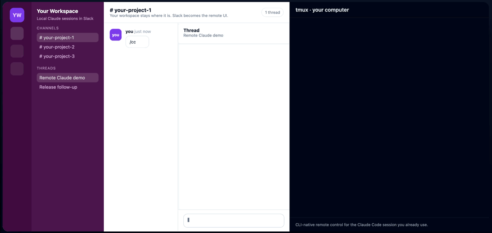

# Remote Claude Code


> 지금 작업 중인 Claude Code를 Slack에서 그대로 이어서 부릴 수 있습니다.

새 에이전트도, 새 원격 IDE도 필요 없습니다. 지금 일하던 로컬/클라우드 작업환경 그대로, 심지어 휴대폰에서도 같은 Claude Code 세션에 일을 시킬 수 있습니다.

[Quickstart](#quickstart) · [Doctor](#doctor) · [How it works](#how-it-works) · [Roadmap](#roadmap)



- **기존 Claude Code 세션을 어디서든 이어서 사용**
- **새 에이전트나 새 원격 개발환경을 강요하지 않음**
- **설치 후 `doctor`로 바로 검증 가능**


## Why this is different

### 이건 이런 제품이 아닙니다

- 새로운 agent platform
- 별도의 remote IDE
- 지금 작업환경을 버리고 옮겨 타는 시스템

### 이건 이런 제품입니다

- **Slack이 원격 UI가 됩니다**
- **Claude Code는 원래 작업하던 환경에서 계속 실행됩니다**
- **당신은 같은 세션을 어디서든 이어서 부립니다**

핵심은 새로운 환경을 배우는 게 아니라, **원래 쓰던 Claude Code를 더 멀리까지 가져가는 것**입니다.

## Quickstart

### 1. 레포 클론 및 Claude Code 실행

```bash
git clone https://github.com/mskangg/remote-claude-code.git
cd remote-claude-code
claude
```

### 2. 플러그인 설치

마켓플레이스 추가:

```bash
/plugin marketplace add mskangg/remote-claude-code
```

플러그인 설치:

```bash
/plugin install remote-claude-code-setup@remote-claude-code
```

### 3. Claude Code에서 셋업 시작

아래처럼 말하면 됩니다.

```text
remote-claude-code 셋업해줘
```

또는:

```text
슬랙 연동 설치해줘
```

### 4. 설치 마법사 진행

setup wizard는 다음 순서로 진행됩니다.
- 로컬 환경 확인
- Slack 콘솔 단계 안내
  - 링크: `https://api.slack.com/apps?new_app=1`
  - manifest 제공 (보기용 + raw)
- 필요한 값을 한 단계씩 수집
- artifact 기반 resume
- `doctor`
- release binary 준비

`apps.manifest.create` 기반 자동 생성 경로는 코드에 남아 있지만, 현재 공개 기본 경로로는 사용하지 않습니다.

### 5. 설치 완료 후 실행

설치가 끝나면 기본 실행 경로는 아래처럼 안내합니다.

```bash
rcc
```

기본 설치 대상은 사용자 로컬 경로 기준 `~/.local/bin/rcc`입니다. setup 마지막에는 이 경로와 shell profile 업데이트를 위한 installer script를 함께 안내합니다.

백그라운드 상시 실행은 아래 명령으로 관리합니다.

```bash
rcc service install    # launchd 서비스 등록 + 시작 (부팅 시 자동 실행)
rcc service start      # 서비스 시작
rcc service stop       # 서비스 중지
rcc service status     # 서비스 상태 확인
rcc service uninstall  # 서비스 해제 + 바이너리 제거
```

### Direct CLI path

플러그인 없이 직접 진행하려면 아래 경로를 사용할 수 있습니다.

#### Guided semi-automatic setup

현재 공개 기준으로 가장 신뢰할 수 있는 설치 경로는 아래입니다.

```bash
# 1. artifact 템플릿 생성
cargo run -p rcc -- setup --write-slack-artifact-template .local/slack-setup-artifact.json

# 2. 값 채운 뒤 merge
cargo run -p rcc -- setup --merge-slack-artifact <patch.json> --json

# 3. 설치 (release 빌드 + 바이너리 설치 + 설정 기록 자동)
# 언어 선택: --locale ko (한국어) 또는 --locale en (기본값, 영어)
cargo run -p rcc -- setup --from-slack-artifact .local/slack-setup-artifact.json --non-interactive --locale ko

# 4. 검증
rcc doctor

# 5. 서비스 등록
rcc service install && rcc service start
```

`setup`은 automation-first 설치 마법사이지만, 현재 공개 기본 경로는 검증된 semi-automatic Slack 콘솔 루트입니다. Claude가 단계별로 링크와 manifest를 제공하고, 값은 하나씩 받아 artifact 기반으로 resume, `doctor`, release build까지 이어집니다.

언어는 `--locale ko|en` 플래그로 지정합니다. 플래그를 생략하면 `RCC_LOCALE` 환경변수를 읽고, 그마저도 없으면 영어가 기본값입니다.

#### Experimental manifest API path

Slack app configuration token이 있으면 `apps.manifest.create` 경로를 실험적으로 시도할 수 있습니다. 다만 현재는 응답과 동작이 안정적이지 않아 공개 기본 경로로 권장하지 않습니다.

앱 실행 뒤 Slack에서 `/cc`를 실행하면 됩니다.

더 자세한 설정은 [`docs/slack-setup.md`](docs/slack-setup.md)에서 볼 수 있습니다.

## Doctor

`doctor`는 “지금 바로 되는 상태인가?”를 빠르게 확인하기 위한 명령입니다.

현재 다음 항목을 검증합니다.

- Slack 토큰 4종
- `.env.local` 존재 여부
- `tmux` 사용 가능 여부
- 상태 DB 경로 생성 가능 여부
- hook events 디렉터리 생성 가능 여부
- `slack/app-manifest.json` 존재 여부
- `data/channel-projects.json` 존재 여부

앱 실행 전에 아래 명령부터 돌리면 됩니다.

```bash
rcc doctor
```

## How it works

- Slack은 첫 번째 원격 UI입니다.
- Claude Code는 기존 로컬 또는 클라우드 작업환경에서 계속 실행됩니다.
- tmux, session, hook relay를 통해 상태와 최종 응답이 Slack thread로 돌아옵니다.
- 앞으로는 같은 모델을 Discord, Telegram까지 확장할 수 있습니다.

## Use cases

### Away from desk
자리에서 벗어나도 휴대폰으로 같은 Claude Code 세션에 작업을 이어서 시킬 수 있습니다.

### In transit
이동 중에도 코드 리뷰, 파일 검토, 다음 액션 정리 같은 일을 Slack thread로 지시할 수 있습니다.

### Long-running sessions
긴 작업을 하나의 thread/session 흐름으로 유지하면서 상태와 최종 응답을 계속 추적할 수 있습니다.

## Setup and docs

- Slack 설정: [`docs/slack-setup.md`](docs/slack-setup.md)
- Setup baseline example: [`docs/setup.example.json`](docs/setup.example.json)
- Slack setup artifact example: [`docs/slack-setup-artifact.example.json`](docs/slack-setup-artifact.example.json)
- Slack setup artifact patch example: [`docs/slack-setup-artifact-patch.example.json`](docs/slack-setup-artifact-patch.example.json)
- Hero export: [`docs/hero-export.md`](docs/hero-export.md)
- 런치 카피 팩: [`docs/launch-copy.ko.md`](docs/launch-copy.ko.md)

## Contributing

버그 리포트, 기능 제안, PR 모두 환영합니다. 자세한 내용은 [CONTRIBUTING.md](CONTRIBUTING.md)를 참고하세요.

## License

MIT © 2026 [mskangg](https://github.com/mskangg)

See [LICENSE](LICENSE) for the full text.

## Roadmap

- Slack-first public launch
- easier setup and onboarding
- Discord transport
- Telegram transport

## Current limitations

- 현재 공개 대상은 Slack 기준으로 설계되어 있습니다.
- `rcc service` 명령은 macOS launchd 기반으로, 현재 macOS 전용입니다.
- `apps.manifest.create`를 쓰려면 app configuration token이 필요합니다.
- Slack 앱 생성이 API로 끝나더라도 설치 승인과 일부 토큰 회수 단계는 여전히 manual-assisted flow가 남을 수 있습니다.
- `.env.local`, channel mapping, `doctor`, release build handoff는 setup이 자동으로 연결합니다.
- 런타임/운영 안정성은 계속 강화 중입니다.
